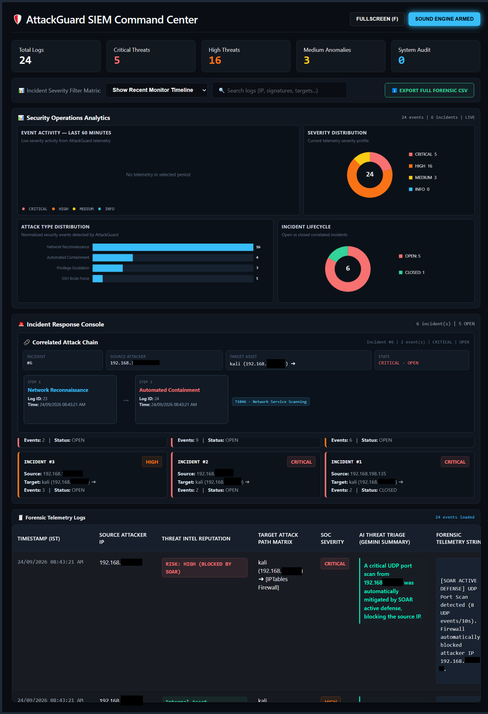
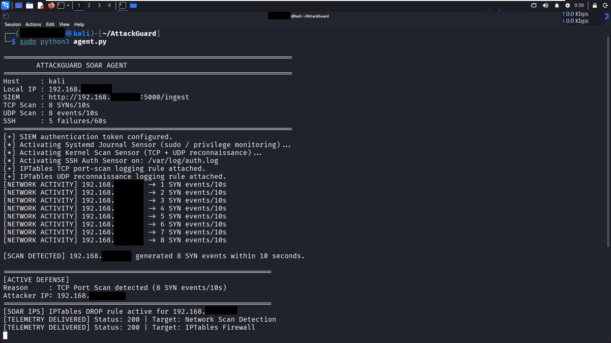
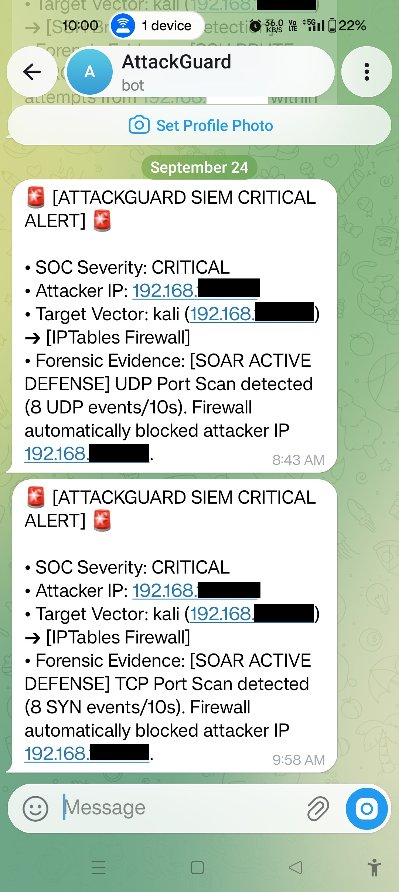

# 🛡️ AttackGuard v2 — SIEM & SOAR Automation Framework

**AttackGuard v2** is a cybersecurity monitoring, detection, threat-intelligence, AI-assisted triage, and automated response framework built for **authorized security testing, cybersecurity education, research, and controlled laboratory environments**.

**Creator / Owner:** Shreyash Vidhate
**Domain:** Cybersecurity / SIEM / SOAR / VAPT / Security Automation

---

## 🚀 What This Project Does

AttackGuard v2 connects a Kali Linux endpoint agent to a Windows-based SIEM command center.

```text
Authorized Testing Activity
          │
          ▼
┌──────────────────────┐
│   Target Kali Linux  │
│      agent.py        │
│                      │
│ • Network detection  │
│ • SSH monitoring     │
│ • Sudo monitoring    │
│ • Kernel monitoring  │
│ • Firewall response  │
└──────────┬───────────┘
           │ Authenticated telemetry
           ▼
┌──────────────────────────────┐
│     Windows SIEM Server      │
│           run.py             │
│                              │
│ • Flask API                  │
│ • SQLite                     │
│ • Incident correlation      │
│ • MITRE ATT&CK mapping      │
│ • Threat intelligence       │
│ • Gemini AI triage           │
│ • Telegram alerting         │
│ • Web dashboard              │
└──────────────────────────────┘
```

---

# 📸 Proof of Work

The fastest way to understand the project is through the actual lab results.

### SIEM Dashboard & Incident Correlation



Shows security telemetry, incident metrics, attack-chain visualization, MITRE ATT&CK mapping, threat intelligence, and AI-assisted triage.

### Detection & Automated SOAR Containment



Shows network-scan detection, automated firewall containment, and authenticated telemetry delivery to the SIEM.

### Critical Telegram Alert



Shows critical-incident notification through the configured Telegram alerting workflow.

> Screenshots are sanitized for publication. Never publish API keys, authentication tokens, passwords, private keys, or other sensitive credentials.

---

# ✨ Key Features

### Detection Engineering
- TCP SYN scan detection
- UDP scan detection
- SSH brute-force detection
- SSH authentication monitoring
- Sudo/privilege activity monitoring
- Kernel and network security-event monitoring
- Firewall containment events

### SIEM & Incident Management
- Authenticated telemetry ingestion
- SQLite event persistence
- Incident correlation
- Severity classification
- Attack-chain visualization
- Incident lifecycle management
- CSV export
- Forensic telemetry

### SOAR / Automated Response
- Automated firewall containment
- Source-IP blocking through `iptables`
- Critical containment telemetry
- End-to-end detection → correlation → response workflow

### Threat Intelligence & AI
- Threat-intelligence enrichment
- MITRE ATT&CK technique mapping
- Gemini AI-assisted incident triage
- Dynamic fallback analysis when AI credentials are unavailable

### Alerting
- Telegram notifications for critical incidents

---

# 🏗️ Architecture

AttackGuard v2 uses three logical nodes:

| Node | Role |
|---|---|
| **Attacker Kali** | Authorized testing activity |
| **Target Kali** | Endpoint monitoring and automated response |
| **Windows SIEM** | Central ingestion, correlation, analysis, dashboard, and alerting |

The same GitHub repository can be cloned onto both the Windows SIEM machine and the Kali endpoint. The difference is the role and configuration of each machine.

---

# 📁 Project Structure

```text
AttackGuard-v2/
│
├── agent.py
├── config.py
├── run.py
├── requirements.txt
├── README.md
├── .gitignore
│
├── core/
│   ├── __init__.py
│   ├── database.py
│   └── ingestion.py
│
├── modules/
│   ├── __init__.py
│   ├── ai_analyst.py
│   ├── alert_router.py
│   └── threat_intel.py
│
├── templates/
│   ├── dashboard.html
│   ├── dashboard1 - Copy.html
│   ├── dashboard2.html
│   └── dashboard3.html
│
└── screenshots/
    ├── 01-siem-dashboard-incident.png
    ├── 02-detection-soar-containment.png
    └── 03-telegram-critical-alert.png
```

### Important files

| File | Purpose |
|---|---|
| `run.py` | Starts the Windows SIEM server |
| `agent.py` | Endpoint monitoring and response agent |
| `config.py` | Environment-based configuration |
| `core/database.py` | Database and incident management |
| `core/ingestion.py` | Telemetry ingestion and processing |
| `modules/ai_analyst.py` | Gemini AI-assisted analysis |
| `modules/alert_router.py` | Telegram alert routing |
| `modules/threat_intel.py` | Threat-intelligence enrichment |
| `templates/dashboard.html` | SIEM web dashboard |
| `requirements.txt` | Python dependencies |

---

# ⚙️ Requirements

## Windows SIEM

- Windows 10/11
- Python 3.11+
- Git
- Network connectivity to the Target Kali machine
- Gemini API key — optional
- Telegram bot credentials — optional

## Kali Agent

- Kali Linux
- Python 3
- Git
- Root/sudo privileges
- Network connectivity to the Windows SIEM

---

# 🚀 Quick Start — Windows SIEM

## 1. Clone the repository

```powershell
git clone https://github.com/shreyash-vidhate/AttackGuard-v2.git
cd AttackGuard-v2
```

## 2. Create a virtual environment

```powershell
python -m venv .venv
.\.venv\Scripts\Activate.ps1
```

If PowerShell blocks activation, run Python directly from the virtual environment.

## 3. Install dependencies

```powershell
pip install -r requirements.txt
```

## 4. Configure environment variables

### Required SIEM authentication

```powershell
$env:ATTACKGUARD_TOKEN="YOUR_OWN_ATTACKGUARD_TOKEN"
```

### Optional Gemini AI

```powershell
$env:GEMINI_API_KEY="YOUR_OWN_GEMINI_API_KEY"
```

### Optional Telegram

```powershell
$env:TELEGRAM_BOT_TOKEN="YOUR_OWN_TELEGRAM_BOT_TOKEN"
$env:TELEGRAM_CHAT_ID="YOUR_OWN_TELEGRAM_CHAT_ID"
```

### Optional server settings

```powershell
$env:ATTACKGUARD_HOST="0.0.0.0"
$env:ATTACKGUARD_PORT="5000"
$env:ATTACKGUARD_DEBUG="false"
```

## 5. Start the SIEM

```powershell
python run.py
```

Open the dashboard locally:

```text
http://127.0.0.1:5000
```

For an authorized lab machine on the same network:

```text
http://<WINDOWS-SIEM-IP>:5000
```

---

# 🐉 Quick Start — Kali Agent

## 1. Clone the repository

```bash
git clone https://github.com/shreyash-vidhate/AttackGuard-v2.git
cd AttackGuard-v2
```

## 2. Create the environment

```bash
python3 -m venv .venv
source .venv/bin/activate
pip install -r requirements.txt
```

## 3. Configure the SIEM destination

```bash
export ATTACKGUARD_SIEM_URL="http://<WINDOWS-SIEM-IP>:5000/ingest"
export ATTACKGUARD_TOKEN="YOUR_OWN_ATTACKGUARD_TOKEN"
```

Verify:

```bash
echo $ATTACKGUARD_SIEM_URL
echo $ATTACKGUARD_TOKEN
```

Do not publish the token.

## 4. Start the agent

The agent performs monitoring and firewall operations that require elevated privileges:

```bash
sudo -E python3 agent.py
```

Using `-E` preserves the configured environment variables when running through `sudo`.

---

# 🔗 Connecting the Nodes

The Windows SIEM and Target Kali must be able to communicate over the authorized lab network.

```text
Windows SIEM
     │
     │ TCP/5000
     ▼
Target Kali
     ▲
     │
     │ Authorized testing traffic
     │
Attacker Kali
```

Use your own private lab IP addresses.

Do not expose the development Flask server directly to the public Internet.

---

# 🧪 Authorized Testing Workflow

A typical validation flow is:

```text
1. Start Windows SIEM
        ↓
2. Start Target Kali agent
        ↓
3. Verify telemetry connectivity
        ↓
4. Generate authorized test activity
        ↓
5. Agent detects activity
        ↓
6. Authenticated telemetry is sent
        ↓
7. SIEM ingests the event
        ↓
8. Event is classified
        ↓
9. Related events are correlated
        ↓
10. Threat intelligence enrichment
        ↓
11. AI-assisted analysis
        ↓
12. Critical alert / automated containment
        ↓
13. Dashboard investigation
```

---

# 🔎 Example Detection Scenarios

These examples are intended only for systems you own or are explicitly authorized to test.

### TCP SYN Scan

```bash
sudo nmap -sS <TARGET-IP>
```

### UDP Scan

```bash
sudo nmap -sU <TARGET-IP>
```

### SSH Authentication Testing

A controlled series of SSH authentication failures can be used to validate the SSH detection logic in an authorized lab.

---

# 🛡️ Automated SOAR Containment

When configured detection conditions trigger an automated response, AttackGuard can perform firewall containment on the monitored endpoint.

Conceptually:

```text
Suspicious Activity
       ↓
Detection
       ↓
Classification
       ↓
Incident Correlation
       ↓
CRITICAL Severity
       ↓
SOAR Response
       ↓
iptables Firewall Block
       ↓
Telemetry to SIEM
       ↓
Dashboard Investigation
```

This demonstrates the integration of:

**Detection + Correlation + Response + Investigation**

---

# 🎯 MITRE ATT&CK Mapping

AttackGuard associates detected activity with relevant MITRE ATT&CK techniques where supported by its event-classification logic.

Examples implemented in the project include:

| Technique | Name |
|---|---|
| `T1046` | Network Service Scanning |
| `T1110.001` | Password Guessing |
| `T1078` | Valid Accounts |
| `T1548.003` | Sudo and Sudo Caching |

The exact technique associated with an incident depends on the observed event and classification logic.

---

# 🤖 Gemini AI Configuration

Gemini AI is optional.

Configure your own key:

```powershell
$env:GEMINI_API_KEY="YOUR_OWN_GEMINI_API_KEY"
```

The repository does **not** contain API credentials.

Users are responsible for creating their own API account, obtaining their own key, and managing API usage and limits.

---

# 📱 Telegram Alerting

Critical incidents can generate Telegram notifications.

Configure:

```powershell
$env:TELEGRAM_BOT_TOKEN="YOUR_OWN_TELEGRAM_BOT_TOKEN"
$env:TELEGRAM_CHAT_ID="YOUR_OWN_TELEGRAM_CHAT_ID"
```

Create and configure your own Telegram bot.

Never publish bot tokens or credentials.

---

# 🔐 Security & Public Repository Hygiene

AttackGuard v2 uses environment variables for sensitive configuration.

Never commit:

```text
.env
.env.*
*.db
*.sqlite
*.log
API keys
Authentication tokens
Telegram bot tokens
Passwords
Private SSH keys
Private certificates
Personal credentials
```

The included `.gitignore` excludes common local secrets, databases, logs, virtual environments, and development artifacts.

If a credential has ever been exposed during development, rotate or revoke it before using the project publicly.

---

# 🖥️ VMware Lab

AttackGuard can be demonstrated in a VMware-based controlled laboratory.

Recommended logical setup:

```text
Windows Host
     │
     ├── Windows SIEM
     │
     └── Virtual Network
             │
       ┌─────┴─────┐
       │           │
 Attacker Kali   Target Kali
                agent.py
```

Recommended network isolation:

- Host-only networking for isolated demonstrations
- NAT when Internet access is required
- Do not expose the SIEM or test endpoint directly to the public Internet

Exact IP addresses depend on the local VMware network configuration.

---

# 🧰 Technology Stack

- Python
- Flask
- SQLite
- Kali Linux
- Windows
- iptables
- Google Gemini API
- Telegram Bot API
- VMware
- MITRE ATT&CK
- Security telemetry
- Threat intelligence
- Automated response

---

# 🧠 Security Engineering Concepts Demonstrated

### Blue Team / SOC

- Security monitoring
- Event detection
- Incident correlation
- Threat intelligence
- Alerting
- Incident investigation
- Automated response

### Red Team / VAPT Lab

- Network reconnaissance
- Port scanning
- SSH authentication testing
- Controlled attack simulation

### Security Engineering

- Endpoint telemetry
- Authenticated API communication
- SQLite persistence
- Incident lifecycle
- MITRE ATT&CK mapping
- SOAR containment
- AI-assisted triage

---

# 🔒 Production Security Notice

AttackGuard v2 is primarily a **security research, education, and controlled laboratory project**.

Before considering production deployment, additional hardening should be performed where appropriate, including:

- HTTPS/TLS
- Strong authentication
- Secure secret management
- API rate limiting
- Network segmentation
- Access control
- Centralized secure logging
- Database hardening
- Input validation
- Secure deployment configuration
- Monitoring of the SIEM itself

Do not expose the development Flask server directly to the public Internet.

---

# 👨‍💻 Creator

## Shreyash Vidhate

**Creator / Owner — AttackGuard v2**

Cybersecurity | VAPT | SIEM | SOAR | Security Automation

AttackGuard v2 was developed as a practical cybersecurity engineering and security-operations laboratory project.

---

# 📄 License

A license has not been included in this initial repository release.

If you want to distribute the project under an open-source license, add an appropriate `LICENSE` file and update this section accordingly.

---

# ⚠️ Authorized Use

AttackGuard v2 is intended **strictly for authorized security testing, cybersecurity education, research, and controlled laboratory environments**.

Use it only on systems and networks you own or have explicit authorization to test.

Security testing should always remain within the scope of the applicable authorization and rules of engagement.

---

## ⭐ Project Goals

AttackGuard v2 demonstrates how multiple security capabilities can be combined into one monitoring and response workflow:

```text
Endpoint Monitoring
        +
Detection Engineering
        +
Incident Correlation
        +
Threat Intelligence
        +
MITRE ATT&CK
        +
AI-Assisted Triage
        +
Alerting
        +
Automated Containment
        =
AttackGuard v2
```

---

**GitHub:** https://github.com/shreyash-vidhate/AttackGuard-v2
